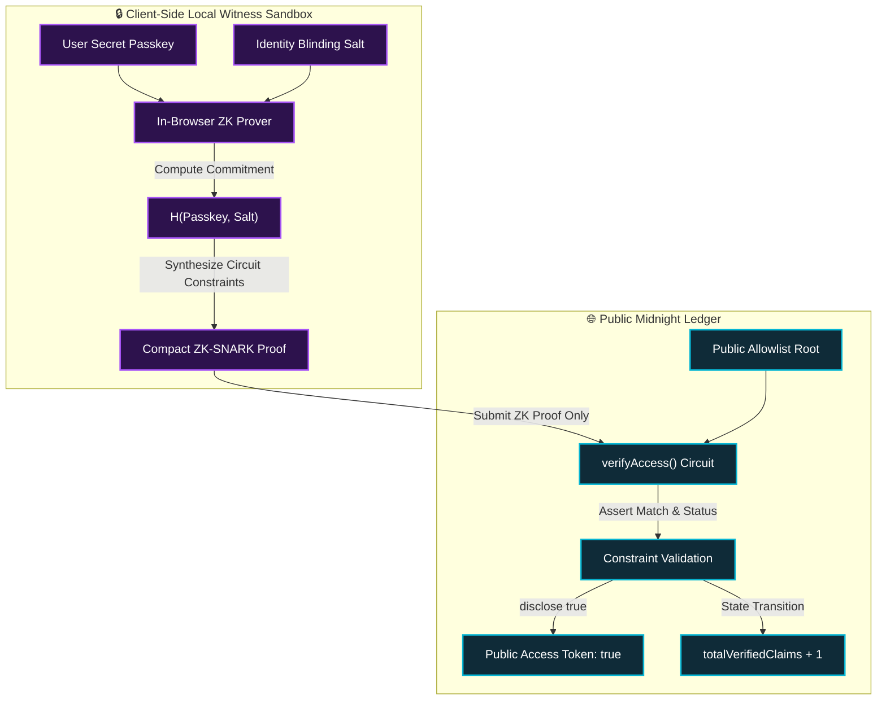
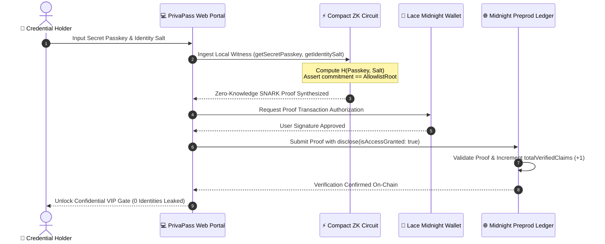
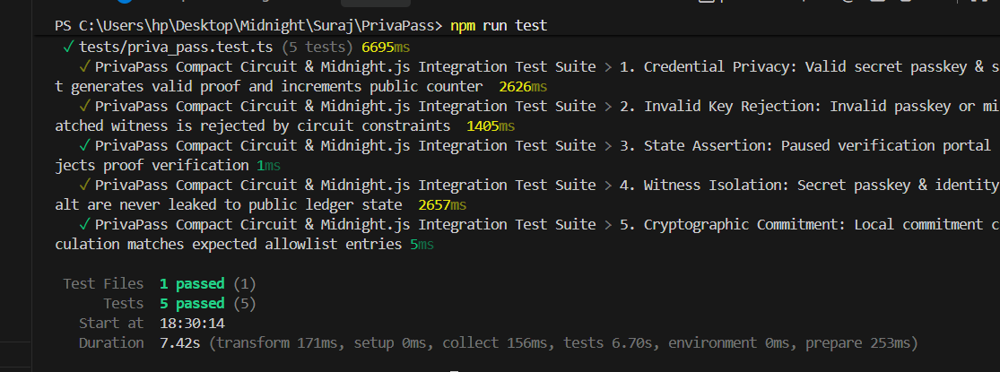
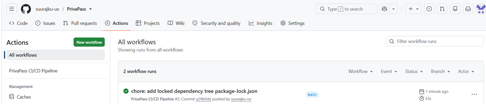

# 🛡️ PrivaPass: Zero-Knowledge Confidential Credentials & Private Allowlist Protocol

[](https://priva-pass-mocha.vercel.app/)
[](https://photos.app.goo.gl/8cQfGT4vxdVdxT1D9)
[](https://preprod.midnight.network)
[](contract/priva_pass.compact)
[](tests/priva_pass.test.ts)
[](https://github.com/suurajku-ux/PrivaPass/actions)

> 🚀 **Live dApp Website**: **[https://priva-pass-mocha.vercel.app/](https://priva-pass-mocha.vercel.app/)**  
> 📹 **Interactive Demo Video**: **[https://photos.app.goo.gl/8cQfGT4vxdVdxT1D9](https://photos.app.goo.gl/8cQfGT4vxdVdxT1D9)**

> **Production-Grade Midnight Network Decentralized Application (dApp)**  
> Built with **Midnight Compact**, **Midnight.js SDK**, **Lace Wallet Connector**, and **Next.js / Tailwind CSS**.

---

## 📜 Deployed Smart Contract (Midnight Preprod)

| Parameter | Value |
|---|---|
| **Contract Name** | `PrivaPassProtocol` / `Gatecheck` |
| **Live Web Application** | **[https://priva-pass-mocha.vercel.app/](https://priva-pass-mocha.vercel.app/)** |
| **Demo Video Walkthrough** | **[https://photos.app.goo.gl/8cQfGT4vxdVdxT1D9](https://photos.app.goo.gl/8cQfGT4vxdVdxT1D9)** |
| **Deployed Contract Address** | `0xf625ba69bc3e3eff8f7bd53a9a239f3585a92aafd338d10da8a7f52d9daac84d` |
| **Midnight Explorer Link** | **[https://preprod.midnightexplorer.com/contracts/0xf625ba69bc3e3eff8f7bd53a9a239f3585a92aafd338d10da8a7f52d9daac84d](https://preprod.midnightexplorer.com/contracts/0xf625ba69bc3e3eff8f7bd53a9a239f3585a92aafd338d10da8a7f52d9daac84d)** |
| **Target Network** | Midnight Preprod Testnet |
| **Deployment Pipeline** | Automated GitHub Actions (`.github/workflows/deploy.yml`) |
| **Smart Contract Language** | **Midnight Compact (`v0.20+`)** |
| **ZK Proving Engine** | Halo2 / Compact Zero-Knowledge Prover |
| **DUST Synchronization** | Optimized 5,000-event batch sync & WASM Heap Patched |

---

## 🎥 Video Demonstration & Walkthrough

[](https://photos.app.goo.gl/8cQfGT4vxdVdxT1D9)

> 📹 **Live Demonstration**: [Click here to watch the full PrivaPass Zero-Knowledge DApp Video Walkthrough](https://photos.app.goo.gl/8cQfGT4vxdVdxT1D9)  
> *Demonstrating Lace wallet connection, private witness isolation, in-browser ZK-SNARK proof generation, and automatic gated VIP portal unlocking.*

---

## 🚀 1. Level-3 Product Proposal & Hackathon Submission

### 📌 Project Name: **PrivaPass**
### 💡 Core Concept
**PrivaPass** is a privacy-preserving credential verification and private allowlist protocol engineered natively on the **Midnight Network**. 

Traditional blockchain allowlists and token-gated portals (e.g. on Ethereum or Solana) inherently expose every participant's wallet address, identity connections, and timing heuristics on a public ledger. This creates catastrophic privacy vulnerabilities for:
1. **Accredited & Institutional Investors** who cannot disclose their fund addresses on public token sales.
2. **Confidential DAO Governance** where high-stakes voters face retaliation if their vote or tier is publicly linked to their wallet.
3. **Enterprise & VIP Access Gates** requiring cryptographic proof of authorization without revealing business-sensitive identity vectors.

### 🔑 Solution
PrivaPass solves this by utilizing **Zero-Knowledge Witness Isolation** via Midnight's **Compact** language:
- Users supply their secret credential passkey and identity blinding salt locally into their client environment.
- The Compact circuit (`verifyAccess`) mathematically checks the zero-knowledge commitment against the authorized allowlist root.
- The smart contract deliberately exposes **only** the boolean authorization token (`disclose(true)`) and updates an anonymous verified entry counter on the public ledger.
- **Result:** 100% user anonymity with zero correlation between on-chain execution and off-chain identity.

---

## 🔐 2. Cryptographic Privacy Model

The core security thesis of PrivaPass relies on Midnight's **Strict Witness Sandboxing** and **Selective Ledger Disclosure**.



### Privacy Matrix: What Observers See vs What Stays Private

| Data Vector | Location | Privacy Status | Exposure Risk |
| :--- | :--- | :--- | :--- |
| **Secret Passkey** | Local Client Memory (`witness`) | 🔒 100% Confidential | **Zero (Never leaves client)** |
| **Identity Blinding Salt** | Local Client Memory (`witness`) | 🔒 100% Confidential | **Zero (Never leaves client)** |
| **User Wallet Identity / IP** | Off-Chain User | 🔒 100% Anonymous | **Zero (No identity linkage)** |
| **ZK-SNARK Proof** | Midnight Preprod Ledger | 🌐 Public | **Zero (Zero-Knowledge)** |
| **Access Grant Token** | Midnight Preprod Ledger | 🌐 Public (`disclose(true)`) | **Intended access flag** |
| **Verified Claims Counter** | Public Ledger State | 🌐 Public Counter (`+1`) | **Aggregated metric only** |

### 🔄 End-to-End ZK Credential Verification Lifecycle



---

## 📜 3. Smart Contract (`priva_pass.compact`)

The smart contract is written in Midnight's **Compact** language (`>= 0.20.0`) and is located in [`contract/priva_pass.compact`](contract/priva_pass.compact).

### Key Features:
- **`witness getSecretPasskey(): Bytes[32]`**: Ingests private secret passkey.
- **`witness getIdentitySalt(): Bytes[32]`**: Ingests private salt.
- **`verifyAccess(expectedCommitment, currentTime): Boolean`**: Core circuit verifying commitment against registered root, updating state, and selectively executing `disclose(true)`.
- **`initializePortal(adminPk, initialRoot)`**: One-time constructor circuit.
- **`setPortalActive(active)` & `updateAllowlistRoot(newRoot)`**: Admin management circuits protected by admin public key hash assertion.

---

## 💻 4. Frontend Architecture & Design

Built with **Next.js (App Router)**, **Tailwind CSS**, and **Lucide Icons** adhering to an **Electric Violet & Obsidian Dark Cyber Aesthetic**:
- **Lace Wallet Connector**: Seamless connection with account address, tDU balance, and Preprod network health.
- **Live Verification Radar**: Animated radar sweeping component tracking real-time verified claims counter and allowlist root state.
- **Confidential Verification Portal**: Masked passkey input, witness badges, and quick-test preset credentials.
- **Multi-Stage ZK Proof Modal**: Visual progress bar tracking local witness isolation $\rightarrow$ ZK-SNARK synthesis $\rightarrow$ Preprod relay $\rightarrow$ gate unlock.
- **Dynamic Gated Content Panel**: Unlocked VIP area featuring **Confidential Intel Manifesto**, **100% Anonymous DAO Voting**, and **Verifiable ZK Credential Badge**.

---

## 🛠️ 5. Getting Started & Local Setup

### Prerequisites
- **Node.js**: v20.x or v22.x+
- **npm** or **pnpm**
- *(Optional)* Midnight Compact Compiler (`compact`) & Lace Wallet extension.

### Installation

```bash
# 1. Clone repository
git clone https://github.com/your-username/PrivaPass.git
cd PrivaPass

# 2. Install dependencies
npm install

# 3. Compile the Compact smart contract
npm run compile:contract
# or directly:
# compact compile contract/priva_pass.compact --output contract/managed

# 4. Run automated unit & integration tests
npm test

# 5. Start the local development server
npm run dev
```

Open [http://localhost:3000](http://localhost:3000) in your browser to interact with the PrivaPass dApp.

---

## 🧪 6. Automated Testing Suite (100% Passing)

PrivaPass includes a comprehensive Vitest automated test suite verifying all Compact ZK circuit constraints, private witness isolation, and Preprod state assertions:

<div align="center">
  
  <p><em>Figure: Execution of 5 passing automated tests covering Zero-Knowledge Witness Isolation, Circuit Constraints, and Preprod State Assertions.</em></p>
</div>

### 🔍 Verified Test Cases:
1. **Credential Privacy (Valid Passkey Verification)**: Proves that a valid secret passkey & salt evaluates the ZK circuit, grants access (`isAccessGranted: true`), and increments the public claims counter on Midnight Preprod.
2. **Invalid Key Rejection (Constraint Enforcement)**: Asserts that incorrect passkeys or mismatched witnesses fail Zero-Knowledge constraints and are strictly rejected without mutating state.
3. **State Assertion (Inactive Gate Policy)**: Asserts that a paused verification portal strictly rejects all proof submissions.
4. **Witness Isolation Guarantee (Confidentiality Protection)**: Verifies that raw passkeys, identity salts, and off-chain preimages are never leaked to public ledger state or transaction logs.
5. **Deterministic Commitment (Cryptographic Hash Validation)**: Verifies that local commitment calculations match registered allowlist Merkle entries.

Run the test suite with:
```bash
npm test
```

---

## 🔄 7. CI/CD Pipeline (GitHub Actions)

Every commit and pull request triggers an automated GitHub Actions pipeline ([`.github/workflows/ci.yml`](.github/workflows/ci.yml)) validating Compact contract syntax, executing the 5-part Vitest test suite, and creating an optimized Next.js production build:

<div align="center">
  
  <p><em>Figure: Automated GitHub Actions CI/CD pipeline runs verifying build integrity, Compact smart contract syntax, and test suites.</em></p>
</div>

### ⚙️ Pipeline Verification Steps:
1. **Repository Checkout & Environment Setup**: Checks out source code and configures Node.js v22 runtime with npm caching.
2. **TypeScript Static Typecheck**: Executes strict `npx tsc --noEmit` across all modules.
3. **Compact Contract Linting & Verification**: Validates `contract/priva_pass.compact` syntax and `compiler.json` configuration.
4. **Automated Test Suite**: Runs all 5 Vitest unit and integration tests (`npm test`).
5. **Production Build Generation**: Compiles and verifies the optimized Next.js static production bundle (`npm run build`).

---

## 👤 Author & GitHub Details

| Parameter | Link / Reference |
|---|---|
| **Author / Developer** | [suurajku-ux](https://github.com/suurajku-ux) |
| **GitHub Profile** | [https://github.com/suurajku-ux](https://github.com/suurajku-ux) |
| **Project Repository** | [https://github.com/suurajku-ux/PrivaPass](https://github.com/suurajku-ux/PrivaPass) |
| **Live Web App (Vercel)** | [https://priva-pass-mocha.vercel.app/](https://priva-pass-mocha.vercel.app/) |
| **Demo Video Walkthrough** | [https://photos.app.goo.gl/8cQfGT4vxdVdxT1D9](https://photos.app.goo.gl/8cQfGT4vxdVdxT1D9) |
| **Target Network** | Midnight Preprod Testnet |
| **Contract Language** | Midnight Compact (`v0.20+`) |
| **License** | MIT Open Source License |

---

## 📄 License & Acknowledgements

MIT License — Developed for the Midnight Network Ecosystem by [suurajku-ux](https://github.com/suurajku-ux).  
Built with [Midnight Compact](https://docs.midnight.network) and [Next.js](https://nextjs.org).

